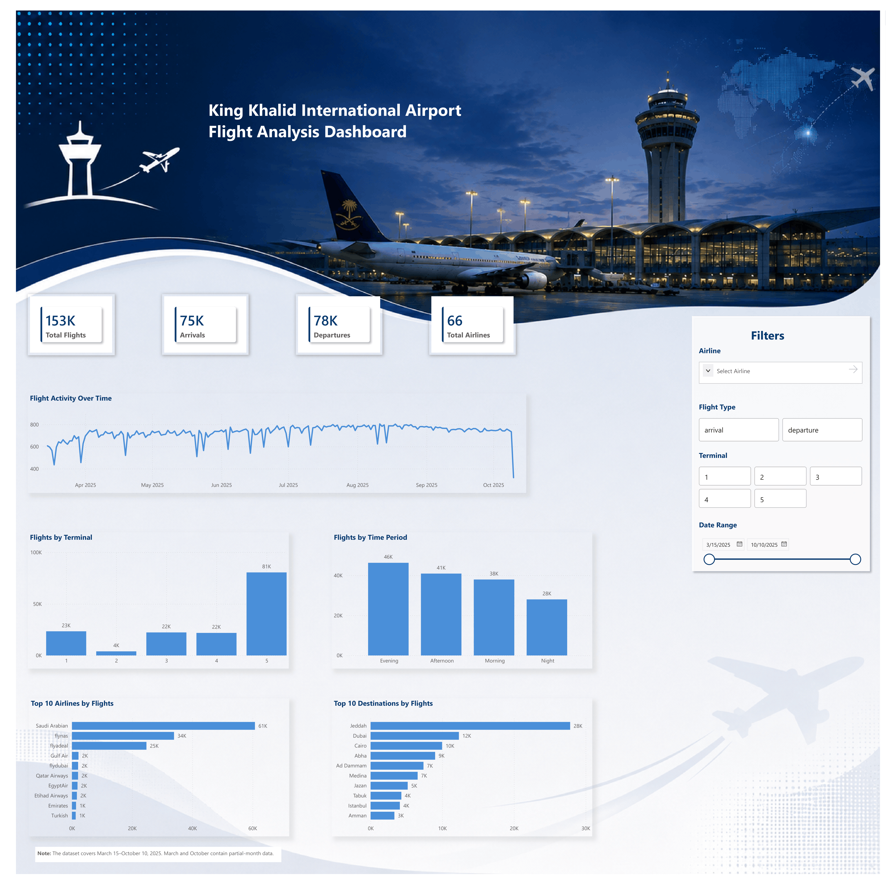

# Saudi Aviation Analysis

This project analyzes flight activity at King Khalid International Airport (RUH) using Excel, Python, and Power BI. The goal is to explore flight patterns, airline activity, terminal usage, and changes in flight activity over time.

## Dataset

The dataset contains flight records from King Khalid International Airport (RUH) in Riyadh, Saudi Arabia.

- **Records:** 153,308 before data cleaning
- **Original columns:** 23
- **Date range:** March 15 to October 10, 2025
- **Data includes:** airlines, flight types, flight status, terminals, origins, destinations, aircraft information, and scheduled flight times
- **Source:** Kaggle

## Tools Used

- **Excel:** Data cleaning, PivotTables, and initial analysis
- **Python:** Data cleaning, feature engineering, exploratory data analysis, and visualization
- **Power BI:** Interactive dashboard and data visualization

## Data Cleaning

The main cleaning steps included:

- Removed 279 duplicate records
- Removed columns with more than 70% missing values that were not needed for the analysis
- Standardized inconsistent airline names
- Converted terminal values to numeric format
- Converted scheduled flight times to datetime format
- Kept remaining missing values when the records were still useful for the analysis

## Feature Engineering

New columns were created from the scheduled local flight time to support the analysis:

- Date
- Month and month name
- Day of the week
- Hour
- Time period (Night, Morning, Afternoon, Evening)
- Day type (Weekday or Weekend)

## Key Findings

- Flight activity generally increased from March and reached its highest levels around July and August.
- Evening had the highest flight activity, with the busiest hours around 6–8 PM.
- Thursday had the highest flight activity, although flight volumes were fairly similar across the days of the week.
- Average daily flight activity was almost the same on weekdays and weekends.
- Saudi Arabian Airlines had the highest flight volume among the top 10 airlines.
- Terminal 5 handled the highest number of flights, while Terminal 2 handled the lowest.

## Power BI Dashboard

The dashboard provides an interactive view of flight activity, including total flights, arrivals and departures, airline activity, destinations, terminal usage, and flight patterns over time.

## Project Files

- `saudi_aviation_analysis.ipynb` — Python data cleaning, feature engineering, and exploratory data analysis
- `Saudi_Aviation.xlsb` — Excel analysis with PivotTables and charts
- `Saudi_Aviation_Analysis.pbix` — Interactive Power BI dashboard
- `powerbi_dashboard.png` — Preview of the final Power BI dashboard

## Data Limitations

- The dataset covers March 15 to October 10, 2025, so March and October contain only partial-month data.
- Some columns contain missing values.
- Most flight status values are listed as `Unknown`, which limits detailed analysis of flight status.

## Data Source

The dataset used in this project is the **King Khalid International Airport Flights Dataset** from Kaggle.

[Dataset on Kaggle](https://www.kaggle.com/datasets/mohammedalsubaie/king-khalid-international-airport-flights-dataset)
